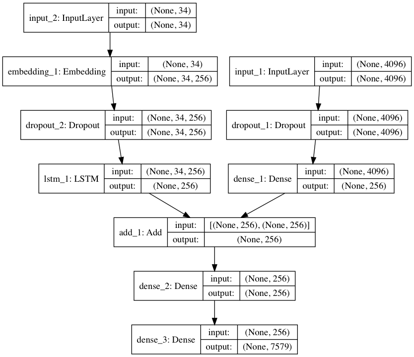

# Image Caption Generator
#### A deep learning model to generate a caption for an image.
###### (Based on the tutorial by [Jason Brownlee](https://machinelearningmastery.com/develop-a-deep-learning-caption-generation-model-in-python "Tutorial Link")) | (Dataset- [Flickr 8K](http://nlp.cs.illinois.edu/HockenmaierGroup/8k-pictures.html))
---
### Caption Generator
<p align="center">
	 
	<br/>
	<i>
		black dog is running through the water
	</i>
</p>
<br/>

### Model

<p align="center">
	 
	<br/>
	<i>
		Deep Neural Network (VGG-16 + LSTM)
	</i>
</p>

<br/>

### Performance
```
BLEU-1: 0.502664
BLEU-2: 0.258071
BLEU-3: 0.173180
BLEU-4: 0.075685
```
